# データベーススキーマ設計

## ER図

```mermaid
erDiagram
    Project ||--o{ Drawing : "1:N 図面"
    Project ||--o{ Survey : "1:N 調査実行"
    Project ||--o{ ExistingPlan : "1:N 既存図セット"
    Project ||--o{ Plan : "1:N プラン"
    Project ||--o{ FileAsset : "1:N ファイル"
    Project ||--o{ SurveyArea : "1:N 調査エリア"
    Project ||--o{ BOQ : "1:N 数量内訳(集計結果)"
    Project ||--o{ Bid : "1:N 業者見積"
    Project ||--o{ CustomerEstimate : "1:N お客様見積"

    Drawing ||--o{ Annotation : "1:N アノテーション"
    Survey ||--o{ SurveyResult : "1:N 調査結果"
    SurveyTemplate ||--o{ SurveyItem : "1:N 大小項目"
    SurveyTemplate ||--o{ Survey : "1:N テンプレ→実行"
    SurveyArea ||--o{ SurveyResult : "1:N エリア別結果"
    Drawing ||--o{ SurveyResult : "0..N 結果→図面紐づけ(任意)"

    ExistingPlan ||--o{ Room : "1:N 部屋(既存)"
    Plan ||--o{ Room : "1:N 部屋(新規)"
    Room ||--o{ Component : "1:N（建具/住設/構造体）"

    %% 既存/新規両文脈での割付
    ExistingPlan ||--o{ FinishAssignment : "1:N 仕上げ割付"
    Plan ||--o{ FinishAssignment : "1:N 仕上げ割付"

    %% マスタ群
    SpecMaster ||--o{ FinishAssignment : "1:N 仕様参照"
    SubstrateMaster ||--o{ FinishAssignment : "1:N 下地参照"
    DemolitionMaster ||--o{ BOQ : "0..N 解体単価参照(任意)"
    PlanMaster ||--o{ BOQ : "0..N 標準単価/係数(任意)"

    %% 数量・見積
    WorkCategory ||--o{ BOQ : "1:N 工事区分別行"
    WorkCategory ||--o{ Contractor : "1:N 得意区分"
    Contractor ||--o{ Bid : "1:N 提出見積"
    Plan ||--o{ BOQ : "1:N プラン集計行"
    BOQ ||--o{ Bid : "0..N 見積の根拠(論理的関連)"

    %% 発注区分→顧客集計区分のマッピング
    WorkCategory ||--o{ CategoryMapping : "1:N"
    EstimateCategory ||--o{ CategoryMapping : "1:N"
    CustomerEstimate ||--o{ CustomerEstimateLine : "1:N 行明細"
    EstimateCategory ||--o{ CustomerEstimateLine : "1:N 集計区分"

    %% ファイル添付
    FileAsset ||--o{ Bid : "0..N 添付(見積PDF等)"
    FileAsset ||--o{ SurveyResult : "0..N 写真等"

    %% 主要属性（抜粋）
    Project {
      UUID project_id PK
      string client_name
      string property_address
      string status
      datetime created_at
      datetime updated_at
    }
    Drawing {
      UUID drawing_id PK
      UUID project_id FK
      string drawing_type "1F/2F/地下/立面EWSN/敷地/床下/小屋裏/傾斜…"
      string source "scan|cad|import"
      string file_ref
      string version
    }
    SurveyTemplate {
      UUID template_id PK
      string name "通常/簡易"
      int major_count
      int minor_count
    }
    SurveyItem {
      UUID item_id PK
      UUID template_id FK
      string major_code
      string minor_code
      string label
      bool auto_measure
    }
    Survey {
      UUID survey_id PK
      UUID project_id FK
      UUID template_id FK
      string mode "通常/簡易"
      string status
      date survey_date
    }
    SurveyArea {
      UUID area_id PK
      UUID project_id FK
      string area_type "屋外/屋外設備/屋内/屋内設備/敷地/その他"
      string location_code "elev_E/S/W/N, 1F/2F/3F, basement, attic, slope…"
    }
    SurveyResult {
      UUID result_id PK
      UUID survey_id FK
      UUID item_id FK
      UUID area_id FK
      UUID drawing_id FK
      float value_numeric
      string value_text
      int severity "1/2/3 等級"
      UUID photo_file_id FK
      string comment
    }
    ExistingPlan {
      UUID existing_plan_id PK
      UUID project_id FK
      string name
      string status
    }
    Plan {
      UUID plan_id PK
      UUID project_id FK
      string name
      string status
    }
    Room {
      UUID room_id PK
      UUID project_id FK
      string plan_context "existing|planned"
      UUID existing_plan_id FK
      UUID plan_id FK
      string room_name
      float area_sqm
      string floor_level
      json position "XYポリゴン"
      UUID origin_room_id "元既存→派生"
      bool is_deleted
      string conversion_note
    }
    Component {
      UUID component_id PK
      UUID project_id FK
      string plan_context "existing|planned"
      UUID plan_or_existing_id
      UUID room_id FK
      string component_type "door|window|fixture|column|beam|wall"
      UUID spec_id FK
      json geom "位置/寸法/向き"
      string grade "std|premium"
    }
    FinishAssignment {
      UUID assignment_id PK
      UUID project_id FK
      string plan_context
      UUID plan_or_existing_id
      string scope "room|exterior|opening|structure"
      UUID target_id "Room/Component等"
      UUID finish_id FK
      UUID substrate_id FK
      string quantity_rule "面積/長さ/枚数"
    }
    SpecMaster {
      UUID spec_id PK
      string category "roof/eaves/fascia/exterior_wall/.../floor/wall/ceiling/fixture"
      string name
      string maker_code
      string unit "m2/m/式/台"
      string notes
    }
    SubstrateMaster {
      UUID substrate_id PK
      string category
      string name
      float standard_thickness
      string notes
    }
    WorkCategory {
      UUID work_cat_id PK
      string name "発注21区分"
    }
    EstimateCategory {
      UUID est_cat_id PK
      string name "顧客向け集計区分"
    }
    CategoryMapping {
      UUID work_cat_id FK
      UUID est_cat_id FK
    }
    BOQ {
      UUID boq_id PK
      UUID project_id FK
      UUID plan_id FK
      UUID work_cat_id FK
      UUID spec_id FK
      float quantity
      string unit
      float unit_price
      float amount
      string source "survey|auto|manual"
    }
    Contractor {
      UUID contractor_id PK
      string name
      UUID work_cat_id FK
    }
    Bid {
      UUID bid_id PK
      UUID project_id FK
      UUID plan_id FK
      UUID work_cat_id FK
      UUID contractor_id FK
      string status "依頼/提出/確定"
      date due_date
      float total_amount
      UUID attachment_file_id FK
    }
    CustomerEstimate {
      UUID cust_estimate_id PK
      UUID project_id FK
      UUID plan_id FK
      string status "ドラフト/申請中/確定/差戻し"
    }
    CustomerEstimateLine {
      UUID line_id PK
      UUID cust_estimate_id FK
      UUID est_cat_id FK
      float amount_before_tax
      float tax
      float amount
    }
    FileAsset {
      UUID file_id PK
      UUID project_id FK
      string file_name
      string file_type
      string path
      string visibility
      int view_count
    }
    Annotation {
      UUID annotation_id PK
      UUID drawing_id FK
      json geom
      string symbol_type
      json properties
    }
```

## 概要

このデータベーススキーマは、リノベーション事業のプロジェクト管理システムを設計したものです。以下の主要な機能領域をカバーしています：

### 主要エンティティ

1. **Project** - プロジェクトの基本情報
2. **Drawing** - 図面管理（1F/2F/立面図等）
3. **Survey** - 調査テンプレートと実行結果
4. **Plan** - 既存図面と新規プラン
5. **Room** - 部屋情報（既存・新規両対応）
6. **Component** - 建具・住設・構造体
7. **BOQ** - 数量内訳書
8. **Bid** - 業者見積
9. **CustomerEstimate** - 顧客向け見積

### 特徴

- UUIDを主キーとして使用
- 既存・新規の両方の文脈に対応
- 調査結果と図面の柔軟な紐づけ
- 工事区分と顧客向け集計区分のマッピング
- ファイル添付機能
- アノテーション機能

このスキーマは、リノベーション事業の全工程（調査→設計→見積→発注）を一貫して管理できるように設計されています。
